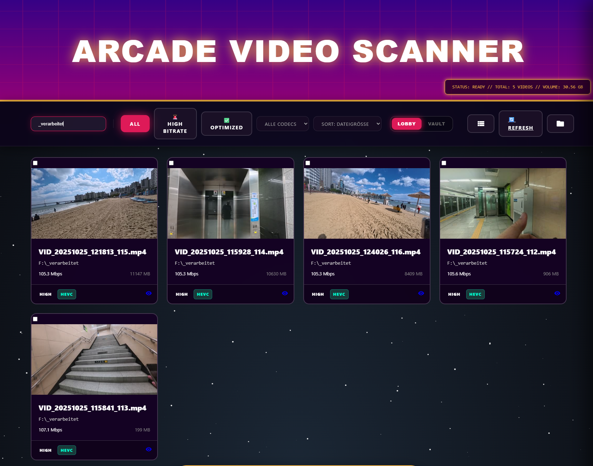
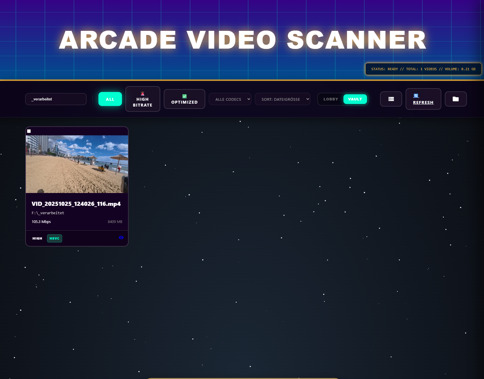

# Arcade Video Scanner 5.1.0 (Settings & Performance Edition)

Arcade Video Scanner is a self-hosted media inventory tool that turns your local video library into a searchable, visual dashboard. It is specifically built for users with massive video collections (e.g., recorded gameplay, arcade collections, project archives) who need to regain disk space without losing track of their files.

### Core Features:
- **Visual Analysis**: Instantly see which videos are "High Bitrate" (candidates for compression) vs. "Optimized".
- **Privacy-First**: No data ever leaves your computer. The scan, database, and web dashboard run 100% locally.
- **Smart Filtering**: Filter by codec (H.264 vs HEVC), bitrate, or file size to pinpoint storage hogs.
- **Interactive Previews**: Hover over any video to see a 5-second preview clip, making it easy to identify content without opening multiple video players.
- **The Vault**: Mark videos as "Archived" to keep your main lobby clean while maintaining a record of all your media.
- **GPU-Powered Optimization**: Cross-platform optimization supporting both NVIDIA (Windows) and Apple VideoToolbox (macOS) hardware acceleration, reducing file sizes by 50-80% with minimal quality loss.
- **Batch Operations**: Select and favorite multiple videos at once with the new batch selection feature.

## 🚀 Version 5.1.0 Highlights

### ⚙️ Settings UI
- **In-App Configuration**: New settings modal (gear icon) allows you to configure scan paths and exclusions directly from the dashboard.
- **Default Exclusions with Toggles**: View all default exclusions with descriptions and enable/disable each one via checkboxes.
- **JSON-Based Config**: Settings now stored in `settings.json` for easier management and future extensibility.

### ⚡ Hardware-Accelerated Preview Generation
- **GPU-Powered Previews**: Preview clip generation now uses hardware encoding (NVIDIA NVENC, Apple VideoToolbox, Intel QuickSync) for 5-10x faster initial scans.
- **Dynamic Worker Count**: Automatically detects your GPU VRAM and sets optimal parallel workers (e.g., 8 workers for RTX 4090).
- **Improved Thumbnails**: Fixed aspect ratio distortion for vertical videos - now uses letterboxing/pillarboxing to preserve original proportions.

### 🛠️ Improved Rebuild Commands
- **`--rebuild-thumbs`**: Regenerate only thumbnails (fast for fixing distorted images).
- **`--rebuild-previews`**: Regenerate only preview clips.
- **Better Progress Messages**: Now shows what's being regenerated (thumbnails, previews, or full scan).

---

> [!IMPORTANT]
> **Initial Start Performance**: The first time you scan your library, the process may take some time depending on the number of video files. With hardware encoding enabled, this is now 5-10x faster than before!

---

## � Visual Overview

| Main Dashboard | The Vault (Archival View) |
| :---: | :---: |
|  |  |

---

## �🛠 Installation

### Prerequisites
- **Python 3.10+**
- **FFmpeg & FFprobe**: Required for media analysis and thumbnail generation.
  ```bash
  brew install ffmpeg
  ```

## ⌨️ Usage

### Standard Launch
```bash
python3 scan_videos_mit_shell.py
```

### Maintenance Mode
```bash
# Cleanup old/orphan cache files
python3 scan_videos_mit_shell.py --cleanup

# Force regenerate all thumbnails
python3 scan_videos_mit_shell.py --rebuild
```

---

## ⚡ Video Optimizer

The tool includes a specialized cross-platform video optimizer (`scripts/video_optimizer.py`) designed to work on both Windows and macOS.

- **Cross-Platform Hardware Acceleration**: 
  - **NVIDIA NVENC** for Windows/Linux systems with NVIDIA GPUs (40-series optimized)
  - **Apple VideoToolbox** for macOS systems (Apple Silicon and Intel)
  - **Software Fallback** for systems without hardware acceleration
- **Automatic Detection**: Intelligently detects your system's capabilities and selects the best encoder.
- **Manual Override**: Use `--encoder nvenc|videotoolbox|software` to force a specific encoding method.
- **Intelligent Transcoding**: Automatically adjusts quality (CQ) and verifies results using **SSIM** (Structural Similarity Index) to ensure significant space savings without visible quality loss.
- **Batch Processing**: Select multiple videos in the dashboard and trigger a sequence of optimization tasks.
- **Interactive Output**: Opens in a separate terminal window, providing real-time progress bars, quality metrics, and estimated completion time.
- **Fun Facts**: Displays random arcade and gaming trivia during the optimization process to keep you entertained!

---

## ⚙️ Configuration
All settings (Scan targets, exclusions, thresholds) are centrally managed in `arcade_scanner/app_config.py`.

### 🚫 Default Exclusions
By default, several system and cloud-related directories are excluded to ensure performance, stability, and to prevent unwanted data downloads.

| Platform | Excluded Directories | Reasoning |
| :--- | :--- | :--- |
| **All** | `@eaDir`, `#recycle`, `Temporary Items` | Skips NAS system folders and trash bins. |
| **Windows** | `AppData/Local/Temp`, `Windows/Temp` | Avoids cluttering results with system temporary files. |
| **Windows** | `iCloudDrive`, `Proton Drive` | Prevents triggering massive "on-demand" cloud downloads. |
| **macOS** | `~/Library/CloudStorage/`, `~/Library/Mobile Documents/` | Prevents scanning iCloud/OneDrive sync folders that trigger downloads. |
| **macOS** | `~/Pictures/Photos Library.photoslibrary` | Avoids scanning internal database files of the Photos app. |
| **macOS** | `~/Library/Containers/` | Skips application-specific sandbox folders. |

### 🔒 Private Configuration
If you want to customize your setup without committing changes to GitHub, you can use these files inside the `arcade_data/` directory:

- **`local_excludes.txt`**: Add folders to skip (one per line).
- **`local_targets.txt`**: Add extra directories to scan (one per line).

*Note: Lines starting with `#` are ignored. These files are automatically skipped by Git.*

### Environment Variables
- `ARCADE_OPTIMIZER_PATH`: Override the default path to the video optimizer script (default: `scripts/video_optimizer.py`).

## 📂 Project Structure
- `arcade_scanner/`: The core Python package.
- `arcade_data/`: Internal storage for the database, thumbnails, and previews.
- `scripts/`: Contains the `video_optimizer.py` and other utility scripts.
- `scan_videos_mit_shell.py`: Main entry point wrapper.
